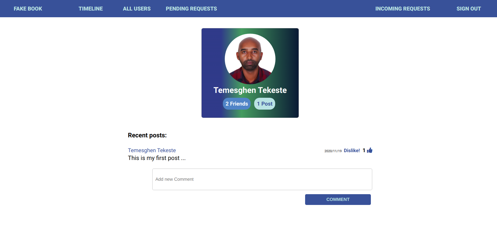
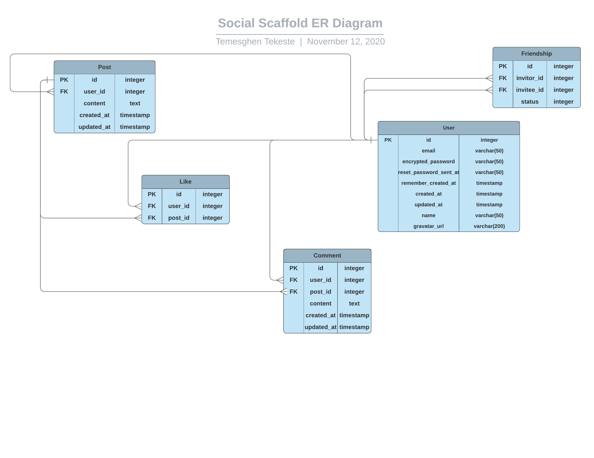

# Fake Book

This project is a microverse solo project which is part of the requirements of the microverse main curriculum in the Rails section. The project is about building a mini social site that utilizes friendship in a way way facebook uses.

In this project, signed in users  can send friend request among each and accept or reject friend requests.

## Built With

- Ruby on Rails (Version: 6.0.3.2)
- Ruby (Version: 2.7.1)
- RSpec
- Capybara
- Shoulda Matchers
- Factory Bot Rails
- Faker
- Devise gem
- PostgreSQL

## 🔴 Live Demo <a name = "live"></a>
*Click [here](https://fakebook-temesghen.herokuapp.com/) in order to see a Live Demo of this project.**


## Screenshots <a name = "sc"></a>




## ER Diagram




## Getting Started

To get a local copy up and running follow these simple example steps.

### Prerequisites

Ruby: 2.6.3
Rails: 5.2.3
Postgres: >=9.5

### Setup

Instal gems with:

```
bundle install
```

Setup database with:

```
   rails db:create
   rails db:migrate
```

### Github Actions

To make sure the linters' checks using Github Actions work properly, you should follow the next steps:

1. On your recently forked repo, enable the GitHub Actions in the Actions tab.
2. Create the `feature/branch` and push.
3. Start working on your milestone as usual.
4. Open a PR from the `feature/branch` when your work is done.


### Usage

Start server with:

```
    rails server
```

Open `http://localhost:3000/` in your browser.

### Run tests

```
    rpsec --format documentation
```

> Tests will be added by Microverse students. There are no tests for initial features in order to make sure that students write all tests from scratch.

### Deployment

TBA


## ✒️  Author <a name = "author"></a>

👤 **Temesghen Tekeste**

- Github: [@temesghentekeste](https://github.com/temesghentekeste)
- Twitter: [@temesghentekes1](https://twitter.com/temesghentekes1)
- Linkedin: [temsghen-tekeste](https://www.linkedin.com/in/temesghentekeste/)


## 🤝 Contributing

Contributions, issues and feature requests are welcome!

Feel free to check the [issues page](https://github.com/temesghentekeste/ror-social-scaffold/issues).


## 👍 Show your support

Give a ⭐️ if you like this project!

## :clap: Acknowledgements

- The Odin Project: [@theodinproject](https://www.theodinproject.com/)
- Microverse: [@microverse](https://www.microverse.org/)
